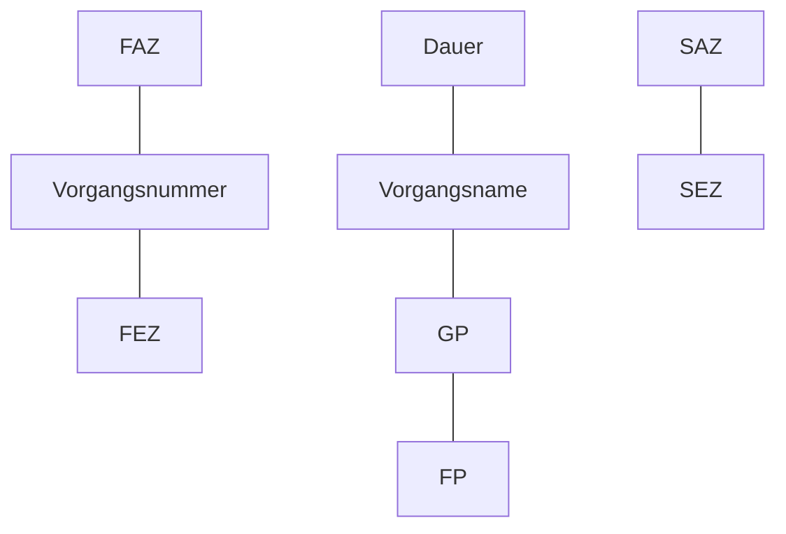

---
# Identity (stable; never change after publishing)
id: ap1-0109
slug: vorgangselemente-netzplan

# Display
title: Elemente eines Vorgangs im Netzplan

# Classification / navigation (machine-side)
module: "Plannen,Vorbereiten und Durchführen von Arbeitsaufgaben"
topics: ["Netzplan", "Netzplantechnik"]
tags: ["prüfungsrelevant", "definition", "netzplan"]

# Flashcard payload
card:
  type: multi
  question: "Welche Elemente und Bezeichnungen gehören zu einem Vorgang im Netzplan?"
  answer: |
    Ein **Vorgang im Netzplan** enthält mehrere standardisierte Elemente zur Planung und Berechnung von Zeitabläufen:

    - **Nummer** – eindeutige Kennzeichnung des Vorgangs
    - **Vorgangsname** – Beschreibung der Aufgabe
    - **Dauer** – benötigte Zeit für die Durchführung
    - **FAZ (frühester Anfangszeitpunkt)** – frühest möglicher Start des Vorgangs
    - **FEZ (frühester Endzeitpunkt)** – frühest mögliches Ende des Vorgangs
    - **SAZ (spätester Anfangszeitpunkt)** – spätester Start ohne Verzögerung des Projekts
    - **SEZ (spätester Endzeitpunkt)** – spätestes Ende ohne Verzögerung des Projekts
    - **GP (Gesamtpuffer)** – maximale Zeitverschiebung eines Vorgangs ohne Verzögerung des Projekts
    - **FP (freier Puffer)** – Zeitreserve ohne Verzögerung des nachfolgenden Vorgangs
  examples:
    - "Ein Netzplanknoten enthält Dauer, früheste und späteste Zeitpunkte sowie Pufferzeiten."
    - "Durch Vergleich von FAZ/SAZ und FEZ/SEZ lassen sich kritische Vorgänge bestimmen."

# Lifecycle
status: published
created: "2026-03-10"
updated: "2026-03-10"
---

## Elemente eines Vorgangs im Netzplan

In der **Netzplantechnik** wird jeder Arbeitsschritt eines Projekts als **Vorgang** dargestellt.  
Dieser Vorgang enthält mehrere **Zeit- und Pufferwerte**, die für die **Terminplanung und Analyse des Projekts** benötigt werden.

Diese Werte werden meist in einem **Vorgangsknoten (Netzplanknoten)** dargestellt.

## Aufbau eines Vorgangsknotens

| Feld | Bedeutung |
|---|---|
| Nummer | eindeutige Identifikation des Vorgangs |
| Vorgangsname | Bezeichnung der Aufgabe |
| Dauer | Zeitbedarf für die Durchführung |
| FAZ | frühester Anfangszeitpunkt |
| FEZ | frühester Endzeitpunkt |
| SAZ | spätester Anfangszeitpunkt |
| SEZ | spätester Endzeitpunkt |
| GP | Gesamtpuffer |
| FP | freier Puffer |



## Bedeutung der Zeitpunkte

| Abkürzung | Bedeutung |
|---|---|
| FAZ | frühester Zeitpunkt, zu dem ein Vorgang beginnen kann |
| FEZ | frühestes mögliches Ende eines Vorgangs |
| SAZ | spätester Startzeitpunkt ohne Projektverzögerung |
| SEZ | spätestes Ende ohne Einfluss auf die Projektdauer |

## Bedeutung der Pufferzeiten

| Puffer | Bedeutung |
|---|---|
| Gesamtpuffer (GP) | Zeitreserve eines Vorgangs innerhalb des gesamten Projekts |
| Freier Puffer (FP) | Zeitreserve ohne Verzögerung des folgenden Vorgangs |

## Zusammenhang mit dem kritischen Pfad

Ein Vorgang gehört zum **kritischen Pfad**, wenn:

```
Gesamtpuffer (GP) = 0
```

Das bedeutet:

- Der Vorgang besitzt **keine zeitliche Reserve**
- Jede Verzögerung **verlängert das gesamte Projekt**

## Prüfungsrelevanz (AP1)

Typische Prüfungsaufgaben:

- Elemente eines **Netzplanknotens benennen**
- **Abkürzungen erklären** (FAZ, FEZ, SAZ, SEZ, GP, FP)
- kritische Vorgänge anhand der **Pufferzeiten erkennen**

Diese Abkürzungen gehören zu den **klassischen Grundlagen der Netzplantechnik**.

## Häufige Fehler

| Fehler | Erklärung |
|---|---|
| FAZ und SAZ verwechseln | FAZ = frühester Start, SAZ = spätester Start |
| Pufferarten verwechseln | GP betrifft das ganze Projekt, FP nur den nächsten Vorgang |
| Dauer mit Zeitpunkten verwechseln | Dauer ist die **Länge der Aktivität**, nicht der Zeitpunkt |