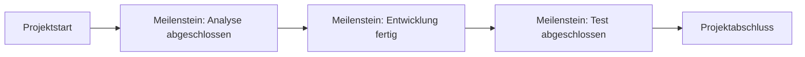

---
# Identity (stable; never change after publishing)
id: ap1-0112
slug: meilenstein-planung

# Display
title: Meilenstein-Planung

# Classification / navigation (machine-side)
module: "Plannen,Vorbereiten und Durchführen von Arbeitsaufgaben"
topics: ["Projektplanung", "Terminplanung"]
tags: ["prüfungsrelevant", "definition", "meilenstein"]

# Flashcard payload
card:
  type: definition
  question: "Wie wird der Begriff Meilenstein-Planung definiert?"
  answer: |
    Die **Meilenstein-Planung** ist eine Methode der **Projektplanung**, bei der wichtige **Zwischenereignisse (Meilensteine)** im Projekt festgelegt werden.

    Meilensteine markieren **bedeutende Punkte im Projektverlauf**, an denen wichtige Ergebnisse erreicht oder überprüft werden.

    Sie dienen dazu, den **Projektfortschritt zu kontrollieren, Termine zu überwachen und die Orientierung im Projekt zu erleichtern**.
  examples:
    - "Abschluss der Analysephase eines Softwareprojekts."
    - "Fertigstellung eines Prototyps vor Beginn der Testphase."

# Lifecycle
status: published
created: "2026-03-10"
updated: "2026-03-10"
---

## Meilenstein-Planung

Die **Meilenstein-Planung** ist ein wichtiges Werkzeug der **Projektsteuerung**.  
Sie strukturiert ein Projekt anhand von **zentralen Ereignissen**, die den Fortschritt sichtbar machen.

Ein **Meilenstein** beschreibt dabei **keine Aufgabe**, sondern einen **wichtigen Zeitpunkt oder Zustand**, der erreicht werden soll.

## Ziele der Meilensteinplanung

| Ziel | Beschreibung |
|---|---|
| Grobe Terminplanung | Überblick über wichtige Termine im Projekt |
| Transparenz | Wichtige Ereignisse werden für alle sichtbar |
| Fortschrittskontrolle | Projektverlauf kann leichter bewertet werden |
| Motivation | Zwischenziele motivieren das Projektteam |

## Eigenschaften eines Meilensteins

| Eigenschaft | Bedeutung |
|---|---|
| Zeitpunkt | markiert ein wichtiges Ereignis |
| Kein Zeitbedarf | Meilensteine haben keine eigene Dauer |
| Kontrollpunkt | dient zur Überprüfung des Projektfortschritts |

## Beispiel aus der IT

Projekt: **Einführung eines neuen CRM-Systems**

| Meilenstein | Bedeutung |
|---|---|
| Projektstart | Projekt offiziell gestartet |
| Anforderungsanalyse abgeschlossen | Anforderungen sind vollständig definiert |
| System implementiert | Software wurde installiert und konfiguriert |
| Testphase abgeschlossen | System funktioniert fehlerfrei |
| Projektabschluss | Projekt erfolgreich beendet |

## Prüfungsrelevanz (AP1)

Typische Prüfungsfragen:

- „Was ist eine Meilensteinplanung?“
- „Wozu dienen Meilensteine im Projekt?“

Wichtige Stichworte:

- wichtige Ereignisse
- Zwischenziele
- Fortschrittskontrolle
- grobe Terminplanung

## Häufige Fehler

| Fehler | Erklärung |
|---|---|
| Meilenstein als Aufgabe verstehen | Ein Meilenstein ist ein **Ereignis**, keine Tätigkeit |
| Dauer angeben | Meilensteine besitzen **keine Dauer** |
| Zu viele Meilensteine definieren | Sie sollten nur **wichtige Projektpunkte** markieren |