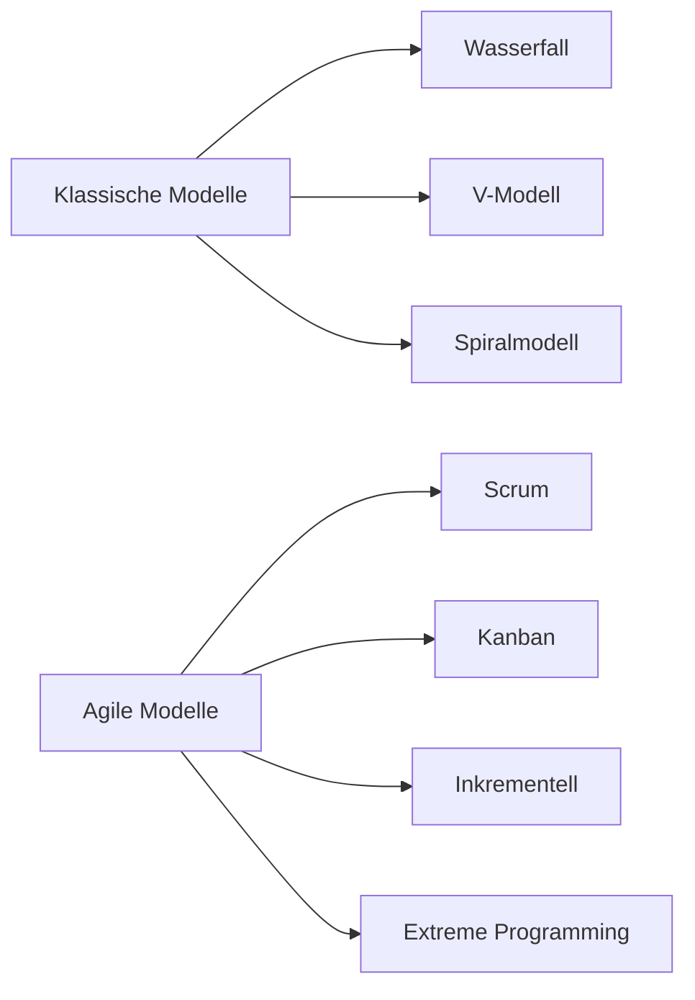

---
# Identity (stable; never change after publishing)
id: ap1-0113
slug: vorgehensmodelle-projektmanagement

# Display
title: Vorgehensmodelle im Projektmanagement

# Classification / navigation (machine-side)
module: "Plannen,Vorbereiten und Durchführen von Arbeitsaufgaben"
topics: ["Vorgehensmodelle", "Softwareentwicklung"]
tags: ["prüfungsrelevant", "überblick", "modelle"]

# Flashcard payload
card:
  type: multi
  question: "Welche Vorgehensmodelle solltest du im Projektmanagement, insbesondere in der Anwendungsentwicklung kennen?"
  answer: |
    In der **Anwendungsentwicklung und im Projektmanagement** unterscheidet man hauptsächlich zwischen **klassischen** und **agilen Vorgehensmodellen**.

    **Klassische Modelle:**
    - Wasserfallmodell
    - V-Modell
    - Spiralmodell

    **Agile Modelle:**
    - Scrum
    - Kanban
    - Inkrementelles Vorgehensmodell
    - Extreme Programming (XP)
  examples:
    - "Ein sicherheitskritisches System wird häufig mit dem V-Modell entwickelt."
    - "Viele moderne Softwareprojekte nutzen agile Methoden wie Scrum oder Kanban."

# Lifecycle
status: published
created: "2026-03-10"
updated: "2026-03-10"
---

## Vorgehensmodelle im Projektmanagement

**Vorgehensmodelle** beschreiben, **wie ein Projekt strukturiert durchgeführt wird**.  
Sie legen fest, **in welcher Reihenfolge Aufgaben erledigt werden, wie Planung erfolgt und wie Ergebnisse überprüft werden**.

In der **Softwareentwicklung** unterscheidet man vor allem zwischen:

- **klassischen (planungsorientierten) Modellen**
- **agilen (flexiblen) Modellen**

## Klassische Vorgehensmodelle

| Modell | Beschreibung |
|---|---|
| Wasserfallmodell | Entwicklung erfolgt strikt nacheinander in klar definierten Phasen |
| V-Modell | Erweiterung des Wasserfallmodells mit starkem Fokus auf Tests |
| Spiralmodell | Iteratives Modell mit besonderem Fokus auf Risikomanagement |

Diese Modelle eignen sich besonders für:

- **stabile Anforderungen**
- **große oder sicherheitskritische Projekte**
- **stark regulierte Umgebungen**

## Agile Vorgehensmodelle

| Modell | Beschreibung |
|---|---|
| Scrum | Iterative Entwicklung in kurzen Sprints |
| Kanban | Kontinuierlicher Arbeitsfluss mit visueller Aufgabensteuerung |
| Inkrementelles Modell | Software wird schrittweise erweitert |
| Extreme Programming (XP) | Agile Methode mit Fokus auf Codequalität und Teamarbeit |

Agile Modelle eignen sich besonders für:

- **dynamische Anforderungen**
- **schnelle Anpassungen**
- **enge Zusammenarbeit mit Kunden**

## Beispiel aus der Praxis

Projekt: **Entwicklung einer neuen Webanwendung**

| Vorgehensmodell | Beispiel |
|---|---|
| Wasserfall | Planung → Entwicklung → Test → Deployment |
| Scrum | Entwicklung in mehreren Sprints mit regelmäßigen Reviews |
| Kanban | Aufgaben werden kontinuierlich über ein Board organisiert |

## Prüfungsrelevanz (AP1)

Typische Prüfungsfrage:

> „Welche Vorgehensmodelle in der Anwendungsentwicklung kennen Sie?“

Wichtige Punkte in der Antwort:

**Klassisch**
- Wasserfallmodell
- V-Modell
- Spiralmodell

**Agil**
- Scrum
- Kanban
- Extreme Programming

## Häufige Fehler

| Fehler | Erklärung |
|---|---|
| Klassische und agile Modelle vermischen | Klassische Modelle sind stärker planungsorientiert |
| Nur Scrum nennen | Es gibt mehrere agile Methoden |
| Modelle mit Projektphasen verwechseln | Vorgehensmodelle beschreiben den **Ablauf der Entwicklung** |