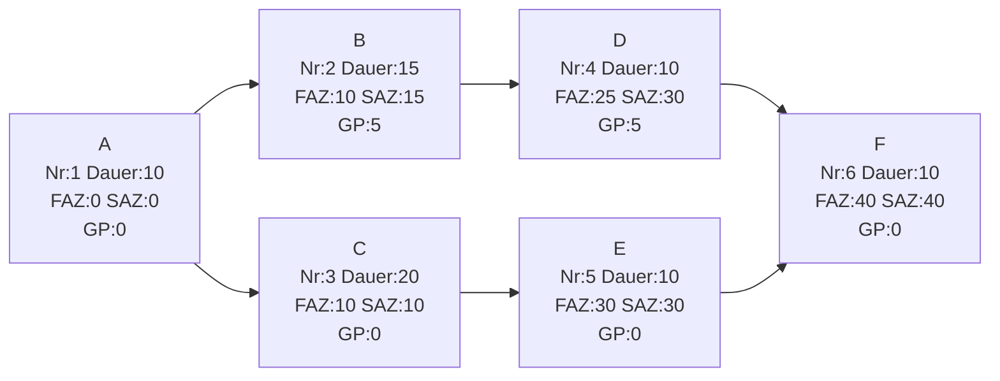

---
# Identity (stable; never change after publishing)
id: ap1-0114
slug: kritischer-pfad-bestimmen

# Display
title: Kritischen Pfad in einem Netzplan bestimmen

# Classification / navigation (machine-side)
module: "Plannen,Vorbereiten und Durchführen von Arbeitsaufgaben"
topics: ["Projektmanagement", "Netzplantechnik"]
tags: ["prüfungsrelevant", "kritischer-pfad", "netzplan"]

# Flashcard payload
card:
  type: basic
  question: "Wie erkennt man im dargestellten Netzplan den kritischen Pfad?"
  answer: "Der kritische Pfad besteht aus allen Vorgängen mit Gesamtpuffer (GP) = 0. In diesem Netzplan: A → C → E → F. Die Projektdauer beträgt 50 Zeiteinheiten."
  examples:
    - "Nicht kritisch: A → B → D → F (enthält Pufferzeiten)"
    - "Kritisch: A → C → E → F (alle Vorgänge haben GP = 0)"

# Lifecycle
status: published
created: "2026-03-10"
updated: "2026-03-10"
---

## Kritischen Pfad in einem Netzplan bestimmen

Der **kritische Pfad** ist der **längste zeitliche Pfad durch einen Netzplan**.  
Er bestimmt die **minimale Projektdauer**.

Merkmale:

- Alle Vorgänge auf diesem Pfad besitzen **Gesamtpuffer (GP) = 0**
- Jede Verzögerung auf diesem Pfad **verzögert das gesamte Projekt**

---

## Struktur eines Vorgangsknotens (5-Felder-Schema)

In der IHK-Netzplantechnik besteht ein Vorgangsknoten aus fünf Feldern:

| Feld | Bedeutung |
|-----|-----------|
| Vorgangsnummer | Identifikation des Vorgangs |
| Dauer | Bearbeitungszeit |
| FAZ | Frühester Anfang |
| SAZ | Spätester Anfang |
| GP | Gesamtpuffer |

Darstellung:

```
+-------------------+
| Nr | Dauer        |
+-------------------+
| FAZ | SAZ         |
+-------------------+
| GP                |
+-------------------+
```

---

## Netzplan (vollständige Darstellung)



---

## Analyse des Netzplans

| Vorgang | Dauer | FAZ | SAZ | GP |
|--------|------|-----|-----|----|
| A | 10 | 0 | 0 | 0 |
| B | 15 | 10 | 15 | 5 |
| C | 20 | 10 | 10 | 0 |
| D | 10 | 25 | 30 | 5 |
| E | 10 | 30 | 30 | 0 |
| F | 10 | 40 | 40 | 0 |

---

## Kritischer Pfad

Alle Vorgänge mit **GP = 0** bilden den kritischen Pfad.

```
A → C → E → F
```

Gesamtdauer des Projekts:

```
10 + 20 + 10 + 10 = 50
```

---

## Vergleich der möglichen Pfade

| Pfad | Berechnung | Dauer |
|-----|-------------|------|
| A → B → D → F | 10 + 15 + 10 + 10 | 45 |
| **A → C → E → F** | **10 + 20 + 10 + 10** | **50** |

Der **längste Pfad bestimmt die Projektdauer**.

---

## Prüfungsrelevanz (AP1)

Typische Aufgaben:

1. **kritischen Pfad bestimmen**
2. **Pufferzeiten berechnen**
3. **Projektdauer bestimmen**
4. **Auswirkungen von Verzögerungen erklären**

Merksatz:

> Der kritische Pfad enthält **keine Gesamtpufferzeiten (GP = 0)** und bestimmt die **Gesamtdauer des Projekts**.

---

## Häufige Fehler

| Fehler | Erklärung |
|------|-----------|
| Pfad mit meisten Vorgängen wählen | Entscheidend ist **Zeit**, nicht Anzahl |
| Nur Dauer betrachten | Kritischer Pfad wird über **Pufferzeiten** identifiziert |
| GP ignorieren | Kritische Vorgänge haben **immer GP = 0** |

---

## Prüfungsstrategie

1. Vorgänge mit **GP = 0** identifizieren  
2. Diese in Reihenfolge verbinden  
3. Gesamtdauer berechnen  

Ergebnis:

```
Kritischer Pfad: A → C → E → F
Projektdauer: 50
```