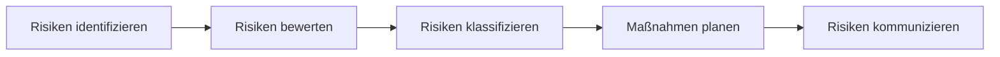

---
# Identity (stable; never change after publishing)
id: ap1-0116
slug: risikoanalyse-bestandteile

# Display
title: Bestandteile einer Risikoanalyse

# Classification / navigation (machine-side)
module: "Plannen,Vorbereiten und Durchführen von Arbeitsaufgaben"
topics: ["Projektmanagement", "Risikomanagement"]
tags: ["prüfungsrelevant", "risikoanalyse"]

# Flashcard payload
card:
  type: basic
  question: "Aus welchen Bestandteilen besteht eine Risikoanalyse?"
  answer: |
    Die Bestandteile einer Risikoanalyse sind:

    - Risikobeurteilung
    - Risikokommunikation
    - Risikoklassifizierung
    - Risikoprävention
  examples:
    - "Risikobeurteilung: Bewertung der Wahrscheinlichkeit und Auswirkungen eines Risikos"
    - "Risikoprävention: Maßnahmen zur Vermeidung oder Reduzierung von Risiken"

# Lifecycle
status: published
created: "2026-03-10"
updated: "2026-03-10"
---

## Bestandteile einer Risikoanalyse

Die **Risikoanalyse** ist ein Bestandteil des **Risikomanagements**.  
Sie dient dazu, mögliche Risiken frühzeitig zu erkennen, zu bewerten und geeignete Maßnahmen zu planen.

---

## Bestandteile der Risikoanalyse

| Bestandteil | Bedeutung |
|-------------|-----------|
| **Risikobeurteilung** | Bewertung der Wahrscheinlichkeit und möglichen Auswirkungen eines Risikos |
| **Risikokommunikation** | Austausch von Informationen über Risiken zwischen Beteiligten |
| **Risikoklassifizierung** | Einordnung der Risiken nach Priorität oder Schwere |
| **Risikoprävention** | Maßnahmen zur Vermeidung oder Reduzierung von Risiken |

---

## Typischer Ablauf einer Risikoanalyse

---

## Einsatzbereiche

Risikoanalysen werden unter anderem eingesetzt in:

- IT-Systemen und IT-Dienstleistungen  
- Großveranstaltungen  
- Produktentwicklung  
- Pharmaindustrie  
- Arbeitsschutz

---

## Prüfungsrelevanz (AP1)

Typische Prüfungsfragen:

- Bestandteile einer Risikoanalyse aufzählen  
- Zweck einer Risikoanalyse erklären  
- Beispiele für Risiken und Gegenmaßnahmen nennen

**Merksatz**

> Die Risikoanalyse bewertet Risiken, ordnet sie ein, kommuniziert sie und leitet Präventionsmaßnahmen ab.