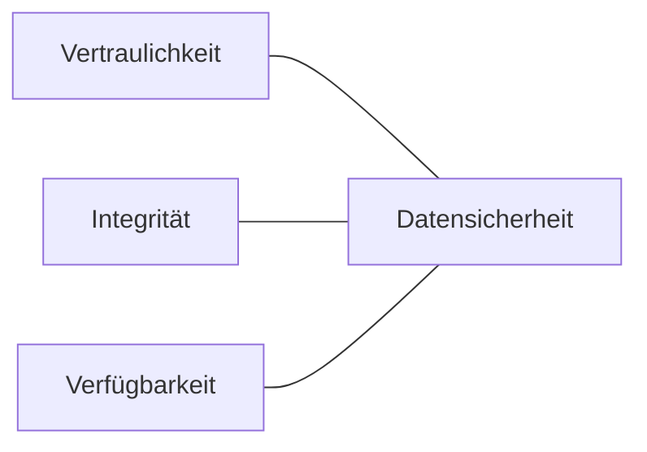

---
# Identity (stable; never change after publishing)
id: ap1-0118
slug: datensicherheit-schutzziele-cia

# Display
title: Hauptziele der Datensicherheit (CIA-Triade)

# Classification / navigation (machine-side)
module: "Plannen,Vorbereiten und Durchführen von Arbeitsaufgaben"
topics: ["IT-Sicherheit", "Grundlagen"]
tags: ["prüfungsrelevant", "cia-triade", "datensicherheit"]

# Flashcard payload
card:
  type: basic
  question: "Was sind die Hauptziele der Datensicherheit?"
  answer: |
    Die drei Hauptziele der Datensicherheit (CIA-Triade) sind:

    - Vertraulichkeit
    - Integrität
    - Verfügbarkeit
  examples:
    - "Vertraulichkeit: Nur berechtigte Personen dürfen auf Daten zugreifen"
    - "Integrität: Daten bleiben korrekt und unverändert"
    - "Verfügbarkeit: Systeme und Daten sind erreichbar, wenn sie benötigt werden"

# Lifecycle
status: published
created: "2026-03-10"
updated: "2026-03-10"
---

## Hauptziele der Datensicherheit (CIA-Triade)

Die **Hauptziele der Datensicherheit** werden häufig als **CIA-Triade** bezeichnet.  
Sie bilden die grundlegenden Prinzipien der Informationssicherheit.

CIA steht für:

- **C – Confidentiality (Vertraulichkeit)**
- **I – Integrity (Integrität)**
- **A – Availability (Verfügbarkeit)**

---

## Die drei Schutzziele

| Ziel | Bedeutung |
|-----|-----------|
| **Vertraulichkeit** | Daten dürfen nur von **befugten Personen** gelesen oder verarbeitet werden |
| **Integrität** | Daten und Systeme bleiben **korrekt, vollständig und unverändert** |
| **Verfügbarkeit** | Systeme und Daten sind **erreichbar und funktionsfähig**, wenn sie benötigt werden |

---

## Beispiele aus der Praxis

| Ziel | Beispiel |
|-----|----------|
| Vertraulichkeit | Passwortschutz oder Verschlüsselung |
| Integrität | Prüfsummen, Hashwerte oder Versionskontrolle |
| Verfügbarkeit | Backups, Redundanz oder Hochverfügbarkeitssysteme |

---

## Zusammenhang der Schutzziele

Alle drei Ziele müssen **gemeinsam erfüllt werden**, um eine sichere IT-Umgebung zu gewährleisten.

---

## Prüfungsrelevanz (AP1)

Sehr häufige Prüfungsfrage.

Man muss:

- die **drei Schutzziele nennen**
- sie **kurz erklären**

**Merksatz**

> Datensicherheit basiert auf **Vertraulichkeit, Integrität und Verfügbarkeit**.