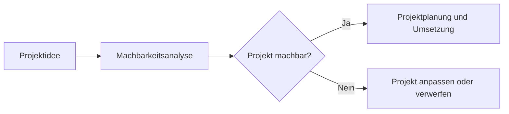

---
# Identity (stable; never change after publishing)
id: ap1-0121
slug: machbarkeitsanalyse-ziele

# Display
title: Ziele einer Machbarkeitsanalyse

# Classification / navigation (machine-side)
module: "Plannen,Vorbereiten und Durchführen von Arbeitsaufgaben"
topics: ["Projektmanagement", "Planung"]
tags: ["prüfungsrelevant", "machbarkeitsanalyse", "projektplanung"]

# Flashcard payload
card:
  type: multi
  question: "Was sind Ziele einer Machbarkeitsanalyse?"
  answer: |
    Ziele einer Machbarkeitsanalyse sind:

    - Prüfung der technischen Machbarkeit
    - Prüfung der organisatorischen Umsetzung
    - Prüfung der rechtlichen Umsetzbarkeit
    - Bewertung der Wirtschaftlichkeit
    - Prüfung der verfügbaren Ressourcen
    - Bewertung der zeitlichen Umsetzbarkeit
  examples:
    - "Technische Machbarkeit: Kann die geplante Software mit der vorhandenen IT-Infrastruktur betrieben werden?"
    - "Wirtschaftlichkeit: Ist das Projekt innerhalb des Budgets finanzierbar?"
    - "Ressourcen: Sind genügend Mitarbeiter, Material und Zeit verfügbar?"

# Lifecycle
status: published
created: "2026-03-10"
updated: "2026-03-10"
---

## Ziele einer Machbarkeitsanalyse

Die **Machbarkeitsanalyse** ist der zentrale Bestandteil einer **Machbarkeitsstudie**.  
Sie untersucht, ob ein geplantes Projekt **realistisch umgesetzt werden kann**.

Dabei werden verschiedene Aspekte eines Projekts geprüft, um Risiken zu erkennen und zu entscheiden,  
ob ein Projekt **durchgeführt, angepasst oder verworfen werden sollte**.

---

## Ziele einer Machbarkeitsanalyse

Im Wesentlichen werden folgende Fragen untersucht:

| Bereich | Leitfrage |
|---|---|
| **Technische Machbarkeit** | Ist das Projekt technisch machbar? |
| **Organisatorische Umsetzung** | Ist die organisatorische Umsetzung möglich? |
| **Rechtliche Umsetzbarkeit** | Ist das Projekt rechtlich zulässig (z. B. Lizenzkosten oder Patente)? |
| **Wirtschaftlichkeit** | Ist das Projekt wirtschaftlich sinnvoll (z. B. Budget oder Finanzierung)? |
| **Ressourcen** | Sind genügend Ressourcen vorhanden (Material, Personal, Maschinen, Zeit)? |
| **Zeitliche Umsetzung** | Ist das Projekt innerhalb des geplanten Zeitrahmens umsetzbar? |

---

## Technische Analyse

Zu den **technisch-wissenschaftlichen Analysen** einer Machbarkeitsanalyse können gehören:

- **Pilottests**
- **Computersimulationen**
- **Expertenmeinungen**
- technische Tests und Bewertungen

Diese Methoden helfen, mögliche Probleme frühzeitig zu erkennen.

---

## Zusammenhang im Projektablauf

---

## Prüfungsrelevanz (AP1)

Typische Prüfungsaufgaben:

- Ziele einer **Machbarkeitsanalyse aufzählen**
- einzelne Bereiche **kurz erklären**
- Zusammenhang mit **Projektplanung und Entscheidungsfindung** verstehen

---

## Merksatz

> Die Machbarkeitsanalyse prüft, ob ein Projekt **technisch, organisatorisch, rechtlich, wirtschaftlich, ressourcenmäßig und zeitlich umsetzbar ist**.