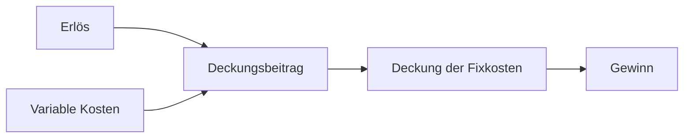

---
# Identity (stable; never change after publishing)
id: ap1-0122
slug: deckungsbeitrag-berechnung

# Display
title: Berechnung des Deckungsbeitrags

# Classification / navigation (machine-side)
module: "Plannen,Vorbereiten und Durchführen von Arbeitsaufgaben"
topics: ["BWL-Grundlagen", "Kostenrechnung"]
tags: ["prüfungsrelevant", "deckungsbeitrag", "kostenrechnung"]

# Flashcard payload
card:
  type: definition
  question: "Auf welche Weise wird der Deckungsbeitrag bei Unternehmen berechnet?"
  answer: |
    Der Deckungsbeitrag berechnet sich aus der Differenz zwischen Erlös
    und den variablen Kosten.

    Formel:
    Deckungsbeitrag = Erlös − variable Kosten
  examples:
    - "Erlös: 100 €; variable Kosten: 60 € → Deckungsbeitrag = 40 €"
    - "Der Deckungsbeitrag dient zur Deckung der Fixkosten und trägt anschließend zum Gewinn bei"

# Lifecycle
status: published
created: "2026-03-10"
updated: "2026-03-10"
---

## Berechnung des Deckungsbeitrags

Der **Deckungsbeitrag** ist eine Kennzahl aus der **Kosten- und Leistungsrechnung**.  
Er zeigt, wie viel von den Erlösen übrig bleibt, nachdem die **variablen Kosten** abgezogen wurden.

Der verbleibende Betrag steht zur **Deckung der Fixkosten** und anschließend zur **Erzielung von Gewinn** zur Verfügung.

---

## Formel

```
Deckungsbeitrag = Erlös − variable Kosten
```

Der Deckungsbeitrag zeigt somit, welchen Beitrag ein Produkt oder eine Dienstleistung  
zur Deckung der **Fixkosten des Unternehmens** leistet.

---

## Zusammenhang der Kosten



---

## Praktisches Beispiel

Ein Unternehmen verkauft ein Produkt für **120 €**.

| Position | Betrag |
|---|---|
| Verkaufspreis (Erlös) | 120 € |
| Variable Kosten | 70 € |

Berechnung:

```
Deckungsbeitrag = 120 € − 70 € = 50 €
```

Der **Deckungsbeitrag beträgt 50 €**.  
Dieser Betrag dient zunächst zur **Deckung der Fixkosten**. Erst danach entsteht **Gewinn**.

---

## Prüfungsrelevanz (AP1)

Typische Prüfungsfragen:

- **Formel des Deckungsbeitrags nennen**
- **Deckungsbeitrag berechnen**
- Unterschied zwischen **fixen und variablen Kosten** verstehen

---

## Häufige Fehler

| Fehler | Erklärung |
|---|---|
| Fixkosten abziehen | Beim Deckungsbeitrag werden **nur variable Kosten** berücksichtigt |
| Deckungsbeitrag mit Gewinn verwechseln | Gewinn entsteht erst **nach Abzug der Fixkosten** |
| Erlös mit Gewinn gleichsetzen | Erlös ist nur der Verkaufspreis |

---

## Merksatz

> Der Deckungsbeitrag zeigt, **wie viel Erlös nach Abzug der variablen Kosten zur Deckung der Fixkosten übrig bleibt**.