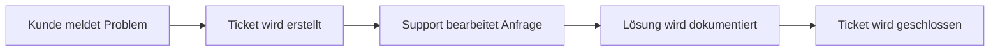

---
# Identity (stable; never change after publishing)
id: ap1-0124
slug: supportanfragen-ticket-system

# Display
title: Software zur Verarbeitung von Supportanfragen

# Classification / navigation (machine-side)
module: "Plannen,Vorbereiten und Durchführen von Arbeitsaufgaben"
topics: ["Support", "IT-Service-Management"]
tags: ["prüfungsrelevant", "ticketsystem", "support"]

# Flashcard payload
card:
  type: multi
  question: "In welchem Softwaresystem werden in der Regel Supportanfragen verarbeitet?"
  answer: |
    Supportanfragen werden in der Regel in einem Ticketsystem verarbeitet.

    Typische Bezeichnungen sind:

    - Ticketing-System
    - User-Helpdesk-System
    - Support-Ticketing-System
    - Service-Ticket-System
    - Task-Tracking-System
    - Request-Tracking-System (RTS)
  examples:
    - "Ein Kunde meldet ein Problem über ein Webportal → es wird automatisch ein Ticket erstellt."
    - "Der Bearbeitungsstatus eines Supportfalls kann über das Ticketsystem verfolgt werden."

# Lifecycle
status: published
created: "2026-03-10"
updated: "2026-03-10"
---

## Software zur Verarbeitung von Supportanfragen

Supportanfragen von Kunden oder Benutzern werden in der Regel in einem **Ticketsystem** verarbeitet.  
Solche Systeme dienen dazu, **Anfragen strukturiert zu erfassen, zu verwalten und nachzuverfolgen**.

Jede Anfrage wird dabei als **Ticket** gespeichert und kann von Supportmitarbeitern bearbeitet werden.

---

## Typische Bezeichnungen für Ticketsysteme

| Begriff | Bedeutung |
|---|---|
| **Ticketing-System** | Allgemeiner Begriff für Systeme zur Verwaltung von Supportanfragen |
| **User-Helpdesk-System** | System zur Unterstützung des IT-Supports |
| **Support-Ticketing-System** | Fokus auf Support- und Kundenanfragen |
| **Service-Ticket-System** | Verwaltung von Servicefällen |
| **Task-Tracking-System** | Verfolgung von Aufgaben und Supportfällen |
| **Request-Tracking-System (RTS)** | System zur Verwaltung und Nachverfolgung von Anfragen |

---

## Funktionen eines Ticketsystems

Ein Ticketsystem übernimmt typischerweise folgende Aufgaben:

- **Empfang und Registrierung** von Supportanfragen  
- **Bestätigung** der Anfrage an den Kunden  
- **Klassifizierung und Priorisierung** der Anfrage  
- **Bearbeitung und Dokumentation** des Problems  
- **Nachverfolgung des Bearbeitungsstatus**

---

## Typischer Ablauf

---

## Prüfungsrelevanz (AP1)

Typische Prüfungsanforderungen:

- **Ticketsystem als Software für Supportanfragen nennen**
- alternative Begriffe wie **Ticketing-System oder Helpdesk-System erkennen**
- grundlegende **Funktion eines Ticketsystems verstehen**

---

## Merksatz

> Supportanfragen werden in der Regel in einem **Ticketsystem (Ticketing-System)** erfasst, bearbeitet und nachverfolgt.