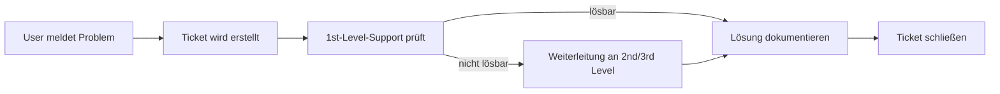

---
# Identity (stable; never change after publishing)
id: ap1-0125
slug: helpdesk-ticketsystem-vorteile

# Display
title: Vorteile eines User-Helpdesk-Ticketsystems

# Classification / navigation (machine-side)
module: "Plannen,Vorbereiten und Durchführen von Arbeitsaufgaben"
topics: ["Helpdesk", "Ticketsystem"]
tags: ["prüfungsrelevant", "support", "service-management"]

# Flashcard payload
card:
  type: multi
  question: "Nenne die Vorteile eines User-Helpdesk-Ticketsystems."
  answer: |
    - Zugriff auf die Service- und Fehlerhistorie für alle Ticketbearbeiter
    - Unterstützung der Weiterentwicklung von Produkten und Services durch Auswertung der Tickets
    - Bessere Koordination von Experten durch Kategorisierung und Support-Level (z. B. 1st/2nd/3rd Level)
    - Unterstützung der Fehleranalyse und Problemlösung durch integrierte Wissensdatenbanken
    - Sammlung und Auswertung von Kundenerfahrungen über Online-Ticketsysteme
  examples: []

# Lifecycle
status: published
created: "2026-03-10"
updated: "2026-03-10"
---

## Vorteile eines User-Helpdesk-Ticketsystems

Ein **Helpdesk-Ticketsystem** ist ein zentrales Werkzeug im IT-Support, mit dem Supportanfragen von Nutzern strukturiert erfasst, bearbeitet und dokumentiert werden. Jede Anfrage wird als **Ticket** gespeichert und durchläuft definierte Bearbeitungsprozesse.

## Zentrale Vorteile
Überblick
| Vorteil | Erklärung |
|---|---|
| Nachvollziehbare Historie | Alle Supportfälle werden dokumentiert. Supportmitarbeiter können frühere Fehler, Lösungen und Kommunikation einsehen. |
| Verbesserte Produkt- und Servicequalität | Häufig auftretende Probleme werden erkennbar und können zur Verbesserung von Software oder Service genutzt werden. |
| Strukturierter Support durch Level | Tickets können nach Supportstufen (z. B. **1st Level, 2nd Level, 3rd Level**) kategorisiert werden, sodass Experten gezielt eingesetzt werden. |
| Nutzung einer Wissensdatenbank | Lösungen für bekannte Probleme werden gespeichert und können später schneller wiederverwendet werden. |
| Analyse von Kundenfeedback | Supportanfragen liefern wertvolle Informationen über Nutzerprobleme und Zufriedenheit. Diese Daten können statistisch ausgewertet werden. |

## Beispiel aus der Praxis

Ein Unternehmen nutzt ein Ticketsystem wie **Jira Service Management** oder **OTRS**:

1. Ein Mitarbeiter meldet ein Problem mit seinem E-Mail-Client.
2. Das System erstellt automatisch ein **Ticket**.
3. Der **1st-Level-Support** prüft das Problem.
4. Falls notwendig wird das Ticket an den **2nd-Level-Support** weitergeleitet.
5. Die Lösung wird dokumentiert und in die **Wissensdatenbank** aufgenommen.

Beim nächsten ähnlichen Problem kann der Support die Lösung sofort wiederverwenden.

## Prüfungsrelevanz (AP1)

In der Prüfung wird häufig abgefragt:

- **Vorteile eines Ticketsystems**
- **Support-Level-Struktur (1st / 2nd / 3rd Level)**
- **Bedeutung von Dokumentation und Wissensdatenbanken**
- **Rolle von Ticketsystemen im IT-Service-Management**

Typischer Erwartungshorizont: **3–5 Vorteile aufzählen**.

## Häufige Missverständnisse

| Missverständnis | Korrektur |
|---|---|
| Ticketsystem = nur Fehlermeldungen | Tickets können auch **Serviceanfragen**, **Änderungswünsche** oder **Informationen** enthalten. |
| Nur Support-Mitarbeiter profitieren | Auch **Management, Entwicklung und Qualitätssicherung** nutzen Ticketdaten zur Analyse. |
| Ticketsystem ersetzt Kommunikation | Es **strukturiert** Kommunikation, ersetzt sie aber nicht vollständig. |

## Vereinfachter Ablauf eines Tickets

