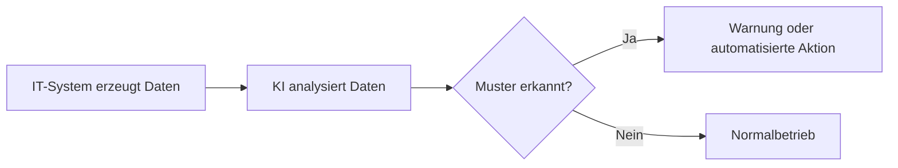

---
# Identity (stable; never change after publishing)
id: ap1-0126
slug: ki-unterstuetzung-iuk

# Display
title: Unterstützung der Informations- und Kommunikationstechnologie durch KI

# Classification / navigation (machine-side)
module: "Plannen,Vorbereiten und Durchführen von Arbeitsaufgaben"
topics: ["Künstliche Intelligenz", "IT-Systeme"]
tags: ["prüfungsrelevant", "ki", "automatisierung"]

# Flashcard payload
card:
  type: multi
  question: "Welche Unterstützung leisten KI-Systeme in der Informations- und Kommunikationstechnologie (IuK)?"
  answer: |
    - Netzwerkmanagement
    - Cybersicherheit
    - Predictive Maintenance (vorausschauende Wartung)
    - Datenanalysen
    - Intelligente Suche bei Problemlösungen
    - Automatisierung von Prozessen
  examples: []

# Lifecycle
status: published
created: "2026-03-10"
updated: "2026-03-10"
---

## Unterstützung der Informations- und Kommunikationstechnologie durch KI

**Künstliche Intelligenz (KI)** kann IT-Systeme dabei unterstützen, große Datenmengen auszuwerten, Muster zu erkennen und Entscheidungen automatisiert vorzubereiten oder zu treffen.  
Dadurch können **IT-Infrastrukturen effizienter, sicherer und zuverlässiger betrieben werden**.

## Zentrale Einsatzbereiche

| Bereich | Erklärung |
|---|---|
| Netzwerkmanagement | KI kann Netzwerkdaten analysieren und automatisch Engpässe, Ausfälle oder ungewöhnliche Aktivitäten erkennen. |
| Cybersicherheit | KI erkennt verdächtige Muster, z. B. ungewöhnliche Loginversuche oder Malware-Verhalten, und kann Angriffe frühzeitig melden. |
| Predictive Maintenance | Systeme analysieren Betriebsdaten und erkennen frühzeitig mögliche Hardwareausfälle, bevor sie auftreten. |
| Datenanalysen | Große Datenmengen werden automatisch ausgewertet, um Trends, Fehlerursachen oder Optimierungspotenziale zu erkennen. |
| Intelligente Problemlösung | KI kann ähnliche frühere Probleme finden und passende Lösungsvorschläge liefern. |
| Prozessautomatisierung | Wiederkehrende IT-Aufgaben wie Ticketklassifizierung oder Systemüberwachung können automatisiert werden. |

## Praxisbeispiel

Ein Unternehmen nutzt KI im **IT-Monitoring**:

1. Server senden kontinuierlich Leistungsdaten (CPU, RAM, Netzwerk).
2. Ein KI-System analysiert diese Daten.
3. Es erkennt ungewöhnliche Muster (z. B. steigende Fehlerraten).
4. Das System erstellt automatisch eine Warnung oder ein Support-Ticket.

Dadurch können **Ausfälle verhindert werden, bevor sie auftreten**.

## Prüfungsrelevanz (AP1)

Typische Prüfungsfragen:

- **„Wie kann KI IT-Systeme unterstützen?“**
- **„Nennen Sie Einsatzbereiche von KI in der IT.“**

Meist werden **3–5 Beispiele** erwartet.

## Vereinfachte Darstellung

## Häufige Missverständnisse

| Missverständnis | Erklärung |
|---|---|
| KI ersetzt IT-Fachkräfte | KI **unterstützt** Entscheidungen, ersetzt aber nicht die Fachkräfte. |
| KI arbeitet ohne Daten | KI benötigt **große Datenmengen**, um Muster zu erkennen. |
| KI trifft immer richtige Entscheidungen | Ergebnisse müssen **überprüft und bewertet** werden. |
