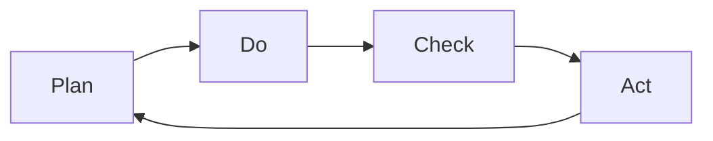

---
# Identity (stable; never change after publishing)
id: ap1-0192
slug: "pdca-zyklus-qualitaetsmanagement"

# Display
title: "PDCA-Zyklus im Qualitätsmanagement"

# Classification / navigation (machine-side)
module: "qualitaetssicherung"
topics: ["pdca", "qualitätsmanagement", "prozesse"]
tags: ["ap1", "kontinuierliche-verbesserung", "iso-9001"]

# Flashcard payload
card:
  type: steps
  question: "Beschreibe den PDCA-Zyklus im Bereich des Qualitätsmanagements."
  answer: "Der PDCA-Zyklus besteht aus vier Phasen: Plan (Probleme analysieren und Ziele festlegen), Do (Maßnahmen umsetzen), Check (Ergebnisse überprüfen) und Act (erfolgreiche Maßnahmen standardisieren und verbessern)."
  examples: []

# Lifecycle
status: draft
created: "2026-25"
updated: "2026-03-25"
---

## PDCA-Zyklus im Qualitätsmanagement

Der PDCA-Zyklus (Plan-Do-Check-Act) ist ein grundlegendes Modell im Qualitätsmanagement zur kontinuierlichen Verbesserung von Prozessen.

Er wird insbesondere im Rahmen der ISO 9001 angewendet.

## Kernerklärung

### Die vier Phasen im Überblick

| Phase | Bedeutung | Inhalt |
|------|----------|--------|
| Plan | Planen | Probleme analysieren, Ist-Zustand erfassen, Ziele und Kennzahlen definieren |
| Do   | Umsetzen | Geplante Maßnahmen durchführen und Daten sammeln |
| Check| Überprüfen | Ergebnisse mit Zielen vergleichen und bewerten |
| Act  | Handeln | Erfolgreiche Maßnahmen standardisieren oder Verbesserungen einleiten |

### Ablauf als Kreislauf

➡️ Wichtig: Der Zyklus wiederholt sich ständig → kontinuierliche Verbesserung (KVP).

## Praktisches Beispiel
Ein IT-Unternehmen verbessert seinen Support-Prozess:

- **Plan**: Lange Antwortzeiten werden erkannt, Ziel: Reaktionszeit < 2h  
- **Do**: Neues Ticketsystem wird eingeführt  
- **Check**: Auswertung zeigt verbesserte Zeiten  
- **Act**: System wird dauerhaft eingeführt und weiter optimiert  

## Prüfungsrelevanz (AP1)

### Typische Prüfungsfragen
- Was bedeutet PDCA?
- Nenne die vier Phasen des PDCA-Zyklus.
- Was passiert in der Check-Phase?
- Warum ist der PDCA-Zyklus wichtig?

### Antworten auf die typischen Prüfungsfragen
- PDCA steht für Plan, Do, Check, Act.
- Vier Phasen: Planung, Umsetzung, Überprüfung, Verbesserung.
- In der Check-Phase werden Ergebnisse mit den Zielen verglichen.
- Er ermöglicht kontinuierliche Verbesserung und strukturierte Prozessoptimierung.

## Merksatz
**PDCA = Planen → Umsetzen → Prüfen → Verbessern → und wieder von vorn.**