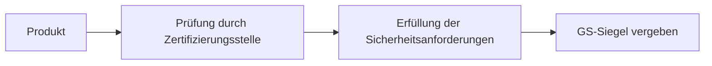

---
# Identity (stable; never change after publishing)
id: ap1-0296
slug: "gs-siegel-gepruefte-sicherheit"

# Display
title: "GS-Siegel (Geprüfte Sicherheit)"

# Classification / navigation (machine-side)
module: "Qualitätssichernde Maßnahmen"
topics: ["gs-siegel", "produktsicherheit", "zertifizierung"]
tags: ["ap1", "sicherheit", "normen", "prüfung"]

# Flashcard payload
card:
  type: basic
  question: "Was bedeutet das Gütesiegel „Geprüfte Sicherheit“ (GS)?"
  answer: "Das GS-Siegel bestätigt, dass ein Produkt die Anforderungen des Produktsicherheitsgesetzes erfüllt und von einer unabhängigen Prüfstelle geprüft wurde."
  examples: []

# Lifecycle
status: published       # draft | published | deprecated
created: "2026-03-25"
updated: "2026-03-25"
---

## GS-Siegel (Geprüfte Sicherheit)
Das GS-Siegel („Geprüfte Sicherheit“) ist ein deutsches Prüfzeichen für Produktsicherheit.  
Es zeigt, dass ein Produkt sicher ist und bestimmte gesetzliche Anforderungen erfüllt.

## Kernerklärung

### Bedeutung des GS-Siegels
- Bestätigung der **Produktsicherheit**
- Einhaltung des **Produktsicherheitsgesetzes (ProdSG)**
- Prüfung durch **unabhängige, zugelassene Prüfstelle**

### Eigenschaften
- Freiwilliges Prüfzeichen (kein Pflichtzeichen wie CE)
- Hohe Aussagekraft für Verbraucher
- Regelmäßige Kontrollen möglich

### Ziel
- Schutz von Anwendern vor Gefahren
- Vertrauen in Produkte erhöhen
- Qualität und Sicherheit sichtbar machen

### Prüfprozess (vereinfacht)

## Praktisches Beispiel
Ein Elektrogerät (z. B. Netzteil):

- Wird auf elektrische Sicherheit geprüft  
- Schutz vor Überhitzung und Kurzschluss wird getestet  
- Besteht alle Prüfungen  

Ergebnis: Gerät erhält das GS-Siegel

## Prüfungsrelevanz (AP1)

### Typische Prüfungsfragen
- Was bedeutet das GS-Siegel?
- Ist das GS-Zeichen verpflichtend?
- Wer vergibt das GS-Siegel?

### Antworten auf die typischen Prüfungsfragen
- Es bestätigt geprüfte Produktsicherheit nach gesetzlichen Anforderungen.  
- Nein, es ist ein freiwilliges Prüfzeichen.  
- Es wird von unabhängigen Prüf- und Zertifizierungsstellen vergeben.

## Merksatz
**GS = Geprüfte Sicherheit → unabhängig getestet und sicher im Gebrauch.**